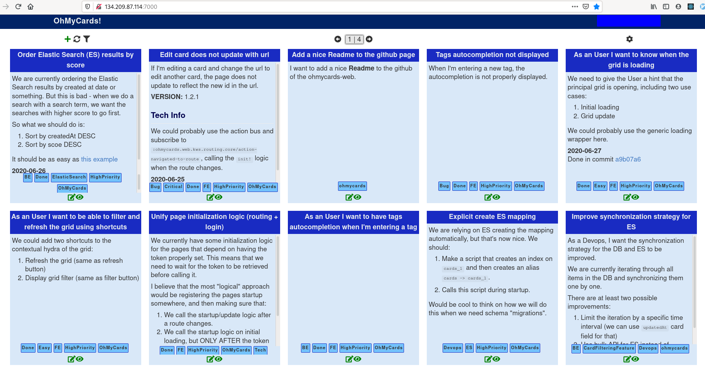

## OhMyCards Server

### About

*OhMyCards* is a small personal web app that I use to manage cards. Each card is
a note written using markdown and categorized by tags. I use it, for example, to
have the backlog for OhMyCards itself.

The [back end](https://github.com/vitorqb/oh-my-cards) is coded in Scala/Play and the [front end](https://github.com/vitorqb/oh-my-cards) is coded in Clojurescript/ReactJS.

Ping me if you want to know anything else :).




### Demo

You can find a running server at [http://134.209.87.114:7000/](http://134.209.87.114:7000/). In
order to log in, all you need is an email address. Or a fake one from
[https://temp-mail.org](https://temp-mail.org)


### Setting Up

The following environmental variables can be used to configure the
application, and are expected to be set:

```bash
# Mailgun url used to send emails.
OHMYCARDS_MAILGUN_URL="https://api.mailgun.net/v3/foo.mailgun.org/messages"

# The "from" email when sending emails.
OHMYCARDS_MAILGUN_FROM="Info OhMyCards <mailgun@foo.mailgun.org>"

# The secret key to authenticate with mailgun
OHMYCARDS_MAILGUN_KEY="foobarbaz"

# The jdbc path to the db
OHMYCARDS_DB_DEFAULT_URL="jdbc:sqlite:dev.sqlite"

# A secret key.
OHMYCARDS_SECRET_KEY="supersecret"

# A port used to connect to ES
OHMYCARDS_ELASTICSEARCH_PORT="9200"

# The host used to connect to ES
OHMYCARDS_ELASTICSEARCH_HOST="127.0.0.1"

# A secret url, under which the admin commands are available.
OHMYCARDS_ADMIN_DASHBOARD_SECRET_URL="admin"
```

### Development

#### Sbt console
The sbt console is usefull and can be used for many of the tasks.

```sh
(. $ENV_FILE && sbt)

#### Unit Tests

```sh
(. .env.test && sbt unitTests)
```

#### Functional Tests

```sh
./dev/start-es.bash -p 9999 -d ohmycards-es-test
(. .env.test && sbt functionalTests)
```

#### Running the app

```sh
./dev/start-es.bash
(. .env && sbt run)
```
